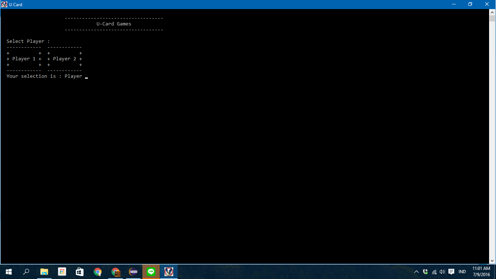
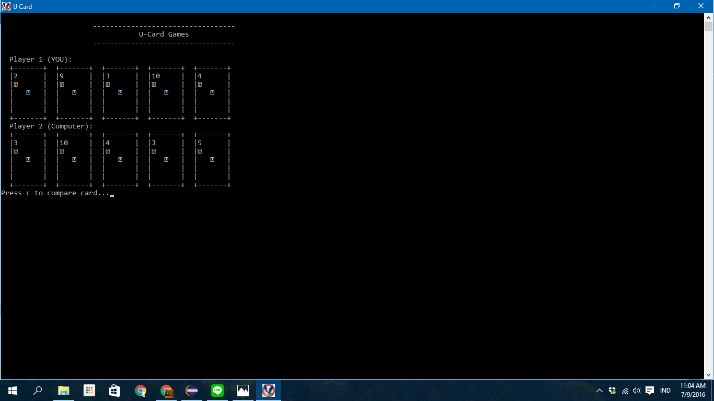
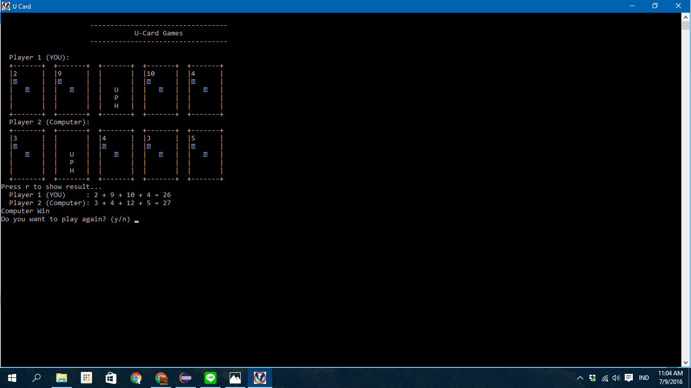

# C++ Card Game
This game is a card game with a console based interface and coded in c++. this game first intended for a private project by student but after the marking was done, this project is released for public studying and development.

#Screenshot

